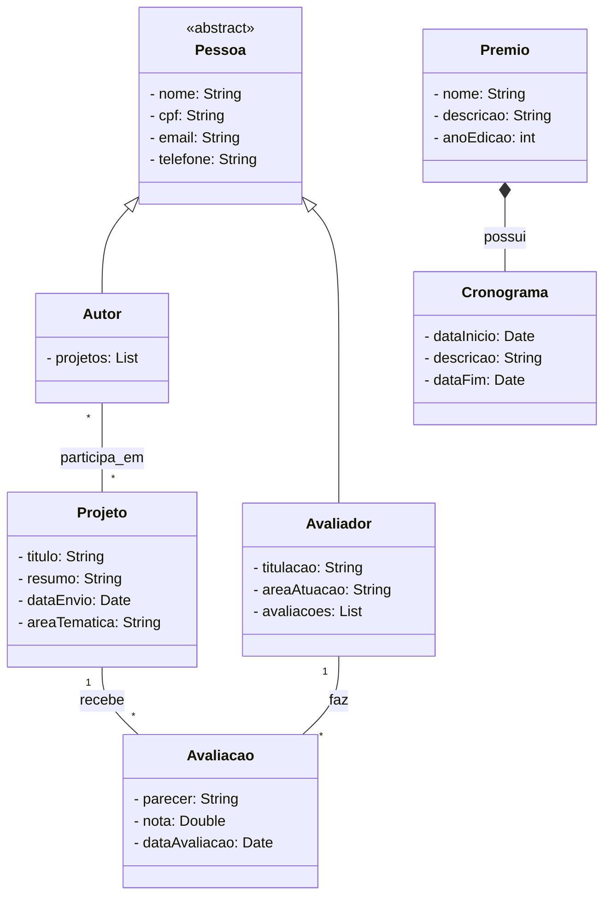

# 📦 Backend - Gestão de Projetos

Este é o backend da aplicação **Gestão de Projetos**, responsável por gerenciar a inscrição e avaliação de projetos. A aplicação é desenvolvida com **Spring Boot** e utiliza várias bibliotecas e ferramentas para fornecer uma API robusta, segura e documentada.

## 🛠️ Tecnologias e Dependências

| Tecnologia / Biblioteca            | Descrição                                                                 |
|------------------------------------|---------------------------------------------------------------------------|
| Spring Boot 3.4.5                  | Framework principal para construção da aplicação.                         |
| Spring Web                         | Para construção de APIs RESTful.                                          |
| Spring Data JPA                    | Integração com JPA para persistência de dados.                            |
| H2 Database                        | Banco de dados em memória para testes e desenvolvimento.                  |
| Lombok                             | Geração automática de getters, setters e outros métodos utilitários.      |
| DevTools                           | Suporte para hot reload no ambiente de desenvolvimento.                   |
| Springdoc OpenAPI (Swagger UI)     | Geração automática de documentação da API em Swagger.                     |
| Spring Boot Test                   | Ferramentas de teste para aplicações Spring.                              |

## ⚙️ Configuração do Projeto

- **Java 17**
- **Codificação:** UTF-8

## ▶️ Execução

Para executar o projeto:

```bash
./mvnw spring-boot:run
```

A aplicação estará disponível em:

```
http://localhost:8080
```

A documentação Swagger estará acessível em:

```
http://localhost:8080/swagger-ui.html
```

## 🧪 Testes

Para executar os testes automatizados:

```bash
./mvnw test
```
## Diagrama de Classe
