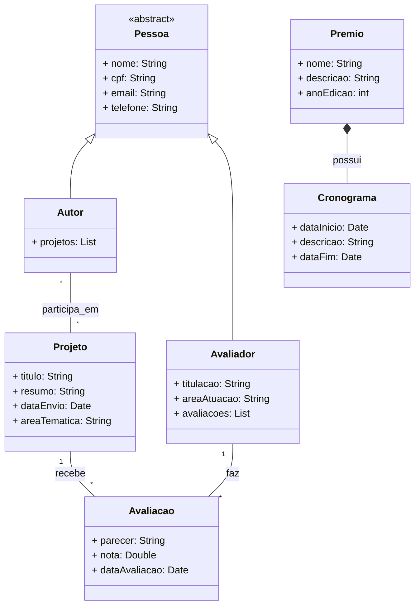

### Funiconamento do Projeto
 

## Diagrama de Classe

```mermaid
classDiagram
    %% Classe abstrata Pessoa
    class Pessoa {
      <<abstract>>
      + nome: String
      + cpf: String
      + email: String
      + telefone: String
    }

    %% Classes que estendem Pessoa
    class Autor {
      + projetos: List<Projeto>
    }
    class Avaliador {
      + titulacao: String
      + areaAtuacao: String
      + avaliacoes: List<Avaliacao>
    }

    Pessoa <|-- Autor
    Pessoa <|-- Avaliador

    %% Classe Premio e composição com Cronograma
    class Premio {
      + nome: String
      + descricao: String
      + anoEdicao: int
    }
    class Cronograma {
      + dataInicio: Date
      + descricao: String
      + dataFim: Date
    }

    Premio *-- Cronograma : possui

    %% Classe Projeto
    class Projeto {
      + titulo: String
      + resumo: String
      + dataEnvio: Date
      + areaTematica: String
    }

    %% Associação muitos-para-muitos entre Autor e Projeto
    Autor "*" -- "*" Projeto : participa_em

    %% Classe Avaliacao e relacionamentos
    class Avaliacao {
      + parecer: String
      + nota: Double
      + dataAvaliacao: Date
    }

    Projeto "1" -- "*" Avaliacao : recebe
    Avaliador "1" -- "*" Avaliacao : faz

```
